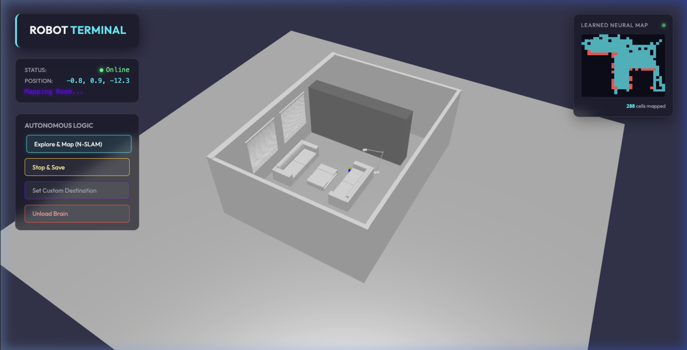
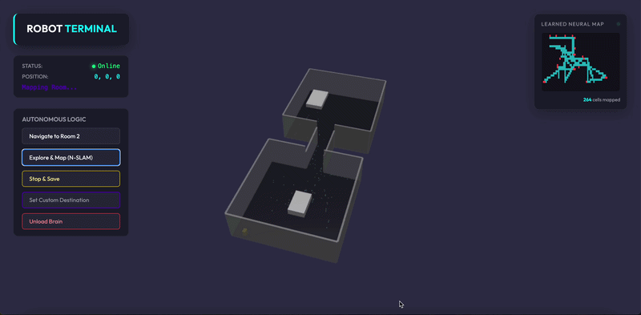

# 🤖 Virtual Robot Mini-Sim

A 3D virtual robot simulator built with **BabylonJS** and **TensorFlow.js**. This project demonstrates a robot navigating a 3D home environment, learning from its surroundings, and planning paths using AI.




## 🌿 Branches

- [**main**](https://github.com/alidasmeh/virtual_robot_in_3d_web_env): Environment with native mesh elements (boxes, spheres, etc.)
- [**3d_model_env**](https://github.com/alidasmeh/virtual_robot_in_3d_web_env/tree/3d_model_env): Environment with 3D model (.glb file)


## ✨ Features

- **3D Environment**: A complete 3D home scene with physics, lighting, and materials.
- **Robot Simulation**: A fully rigged and animated robot with realistic movement.
- **AI Navigation**: A "Brain" module that uses **A*** pathfinding and **TensorFlow.js** for environment mapping.
- **Autonomous Logic**:
  - **Explore & Map**: The robot explores the environment and builds a mental map.
  - **Navigate to Room**: The robot plans and executes a path to a specific destination.
- **Real-time Feedback**: Live status updates, position tracking, and brain activity indicators.
- **Physics-Based Interaction**: Realistic collisions and movement using Cannon.js.

## 🚀 Getting Started

### Prerequisites

- **Node.js** (v14 or higher)
- **npm** (or yarn)

### Installation

1.  Clone the repository:
    ```bash
    git clone <repository-url>
    cd virtual_robot_in_3d_web_env
    ```

2.  Install dependencies:
    ```bash
    npm install
    ```

### Running the Application

Start the development server:

```bash
npm run dev
```

Open your browser and navigate to `http://localhost:5173`.

## 🎮 Controls

### Manual Navigation

Use the keyboard arrows to control the robot:

- **▲**: Forward
- **▼**: Backward
- **◄**: Left
- **►**: Right

### Camera Controls

- **Mouse Drag**: Rotate the camera
- **Mouse Wheel**: Zoom in/out
- **WASD**: Move camera

### Autonomous Controls

- **Explore & Map**: The robot will start exploring the environment and mapping obstacles.
- **Navigate to Room 2**: The robot will plan a path to the second room and navigate to it.

## 🖼️ Updating the 3D Model

To update the environment with your own 3D model:

1.  **Prepare your Model**: Export your 3D scene from Blender (or other tools) as a `.glb` or `.gltf` file.
2.  **Add to Project**: Place the file in the `3d_model_files/` directory.
3.  **Update Configuration**: Open `main.js` and find the `BABYLON.SceneLoader.ImportMeshAsync` call (around line 106).
    - Update the third argument with your new filename.
4.  **Adjust Scaling (Optional)**: If your model is too large or small, adjust the scaling factor in `main.js` (around line 116):
    ```javascript
    root.scaling.scaleInPlace(0.06); // Change 0.06 to your desired scale
    ```

---

## 🏗️ Architecture

### Core Modules

- **`main.js`**: Central entry point. Handles scene initialization, asset loading, robot creation, and UI event listeners.
- **`brain.js`**: The intelligence center. Manages environment mapping, pathfinding (A*), and persists learned state.
- **`style.css`**: Premium glassmorphism UI styles and layout.
- **`trained_models/`**: Stores learned neural maps in JSON format.

### AI & Machine Learning




The `brain.js` module implements:

- **A* Algorithm**: For efficient pathfinding between known traversable points.
- **Spatial Mapping**: A grid-based system that records where the robot has successfully moved.
- **World Persistence**: One-click saving and loading of learned "Mental Maps".
- **Real-time Visualizer**: A 2D overlay showing the robot's current understanding of the floor plan (Green = traversable, Red = obstacles).

## 🛠️ Development

### Project Structure

- **`/3d_model_files`**: Put your GLB/GLTF environment files here.
- **`/files`**: Project documentation assets (images, gifs).
- **`/trained_models`**: Local storage for your saved brain maps.

### Managing Brains

This project uses a custom Vite middleware to list and save models locally:

- **Saving**: Click "Stop & Save" or "Save Current Learned Map" to write the current brain state to a JSON file in `trained_models/`.
- **Loading**: Use "Load Brain" to open a modal and select a previously saved map.
- **Unloading**: Use "Unload Brain" to start fresh or prepare for a new load.

---

### Tips for Better Mapping

- **Manual Start**: Use the arrow keys to guide the robot into open areas before starting "Explore & Map".
- **Custom Destinations**: Click the brain icon or the "Set Custom Destination" button, then click anywhere on the 3D floor to command the robot to go there (only works for learned areas).
- **Shift + I**: Toggle the BabylonJS Inspector (Shift+I) while in the app for advanced debugging and ruler tools.